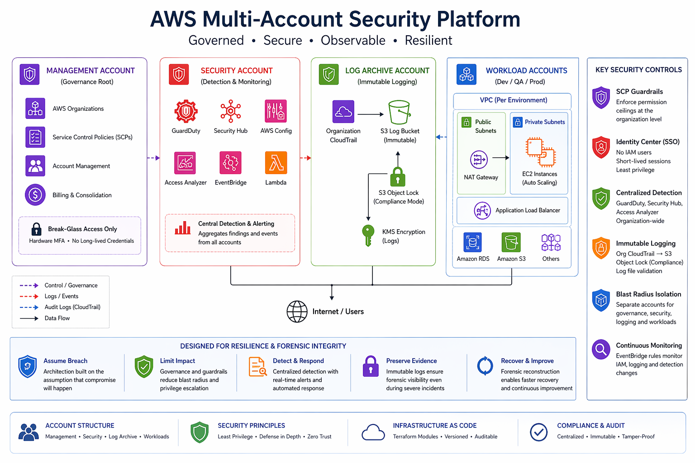

# AWS Multi-Account Security Platform (Terraform)

## Overview

This project implements a production-oriented AWS multi-account architecture focused on **governance, detection resilience, and blast-radius containment**.

It models a real-world enterprise setup where compromise is assumed, and the system is designed to **limit impact, preserve audit integrity, and enable forensic recovery** rather than rely solely on prevention.

---

## What This Project Demonstrates

- Organization-level governance using SCPs (not just IAM)
- Centralized detection and monitoring across accounts
- Separation of control plane, detection plane, and workloads
- Immutable logging for forensic integrity
- Terraform-first modular infrastructure design

---

## Architecture Overview

The architecture separates responsibilities across accounts:

| Account        | Responsibility                          |
|----------------|----------------------------------------|
| Management     | Governance root, SCP enforcement        |
| Security       | Detection, aggregation, alerting        |
| Log Archive    | Immutable audit logging                 |
| Workloads      | Application environments                |

---

### Control Flow

## Architecture Overview

---

## Key Strengths

### 1. Governance First (SCP-Centric Design)
- SCPs enforce **non-bypassable permission ceilings**
- Prevents privilege escalation regardless of IAM misconfiguration

---

### 2. Blast Radius Isolation
- Multi-account structure isolates failures and compromises
- Security tooling separated from workloads

---

### 3. Detection Independence
- Detection runs in **Security account**, not workloads
- Workloads cannot disable monitoring without organization-level compromise

---

### 4. Forensic Integrity
- Logs stored in **separate Log Archive account**
- S3 Object Lock (compliance mode) ensures immutability
- Log file validation enabled

---

### 5. Identity-First Access Model
- IAM Identity Center (SSO)
- No IAM users
- No long-lived credentials
- Short-lived sessions only

---

## Threat Modeling & Controls

This architecture explicitly maps threats to controls instead of assuming security.

---

### Threat: IAM Privilege Escalation

**Example:** Attach `AdministratorAccess` to a role

**Controls:**
- SCP denies policy attachment
- Permission boundaries restrict IAM creation
- EventBridge detects escalation events

**Outcome:**
- Escalation blocked
- Attempt logged centrally

---

### Threat: Logging Disablement

**Example:** `StopLogging`, delete CloudTrail

**Controls:**
- SCP denies logging changes
- Org-wide CloudTrail enforced
- Logs stored cross-account

**Outcome:**
- Logging cannot be disabled from workload accounts

---

### Threat: Management Account Compromise

**Reality:** Full control possible

**Mitigation Strategy:**
- Immutable logs (Object Lock)
- Cross-account logging
- Forensic reconstruction remains possible

**Design Decision:**
> Detection may degrade, but evidence must survive

---

## Identity Governance Model

- IAM Identity Center enabled
- No standing admin roles
- Privileged access is:
  - Time-bound
  - Approved
  - Logged

### Break-Glass Access
- Hardware MFA required
- Fully audited
- Mandatory post-incident review

---

## Detection Architecture

Layered approach:

1. GuardDuty (Org-level)
2. Security Hub aggregation
3. Access Analyzer (org-wide)
4. EventBridge detection rules
5. Organization CloudTrail (source of truth)

Detection logic is **centralized and isolated from workloads**

---

## Terraform Design

- Fully modular structure:
  - global
  - security
  - logging
  - network
  - workload

- Remote backend:
  - S3 (encrypted, versioned)
  - DynamoDB (state locking)

- Designed for:
  - Reusability
  - Auditability
  - Safe changes

---

## Known Limitations (Honest Trade-offs)

This is not a full enterprise landing zone:

- No AWS Control Tower
- No external SIEM integration
- No automated remediation (limited SOAR)
- No cost governance (Budgets / anomaly detection)
- No full CI/CD pipeline for Terraform
- Management account remains ultimate trust anchor

---

## Design Philosophy

This system assumes:

- Credentials **will be compromised**
- Misconfigurations **will happen**
- Detection **may temporarily fail**

Therefore, it prioritizes:

- Blast-radius reduction
- Centralized control
- Immutable audit trails
- Deterministic detection of escalation
- Explicit acknowledgment of residual risk

---

## Outcome

- Built a governance-first multi-account architecture
- Enforced non-bypassable security controls via SCPs
- Centralized detection and logging across accounts
- Demonstrated real-world threat modeling and control mapping
- Designed for resilience, not just prevention

---

## Future Improvements

- Integrate AWS Control Tower
- Add external SIEM (Splunk / OpenSearch)
- Implement automated remediation pipelines
- Add cost governance (Budgets + anomaly detection)
- Expand detection coverage with custom rules
